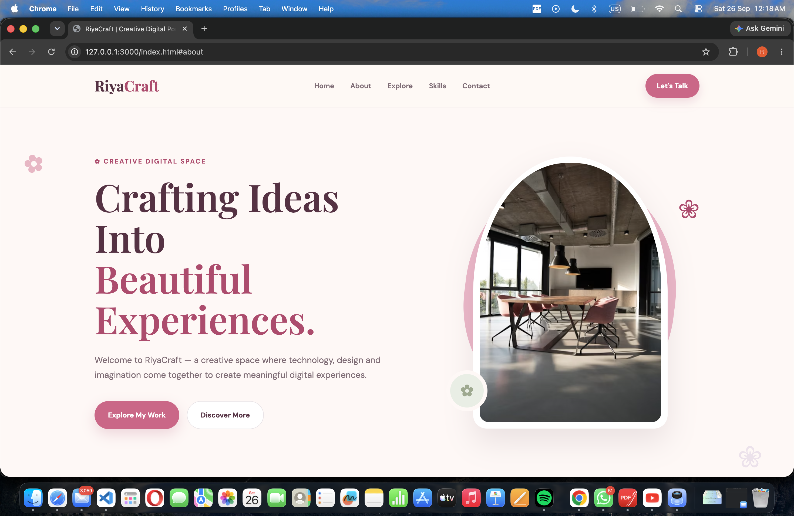
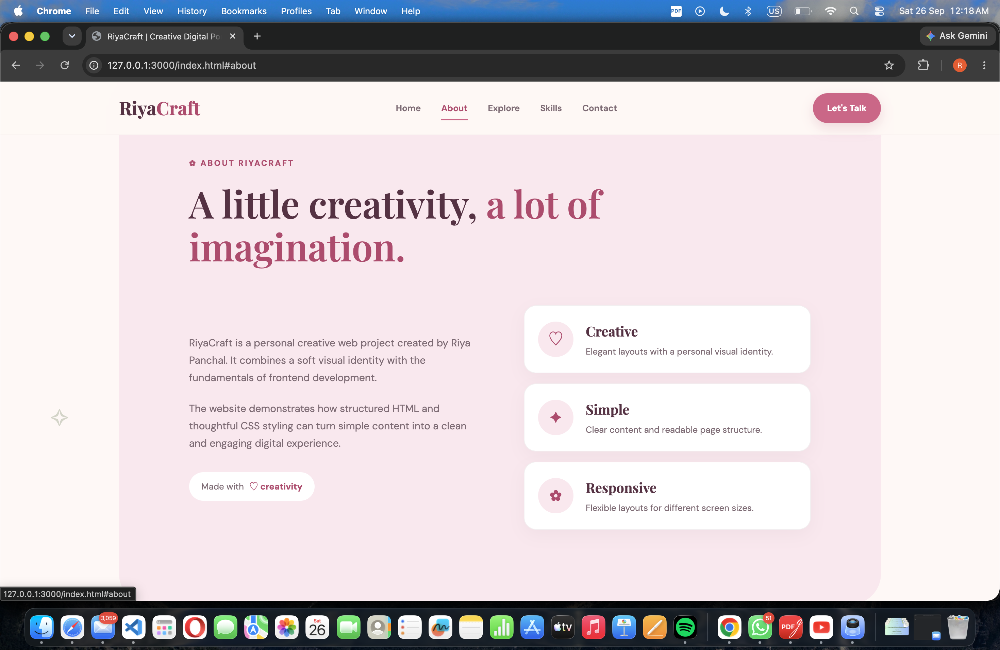
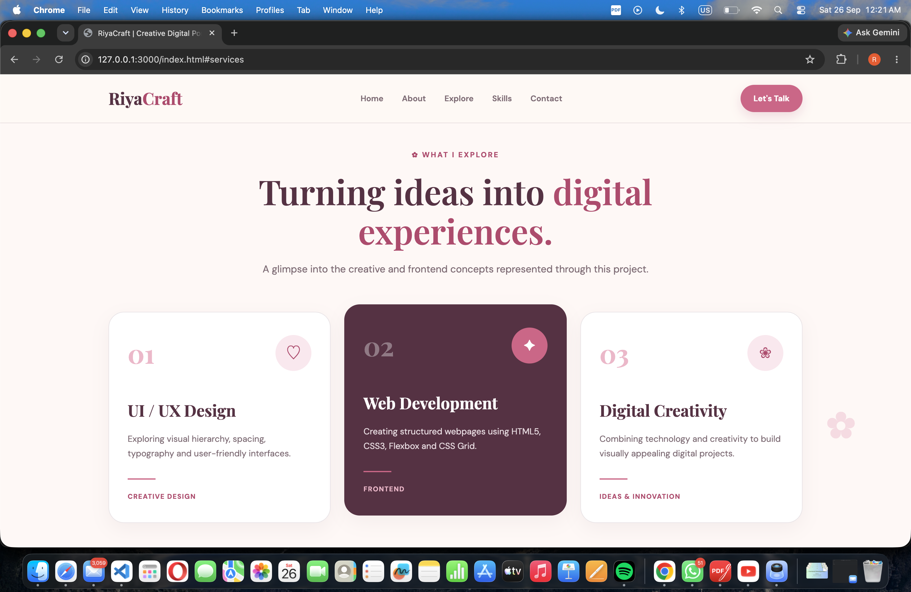
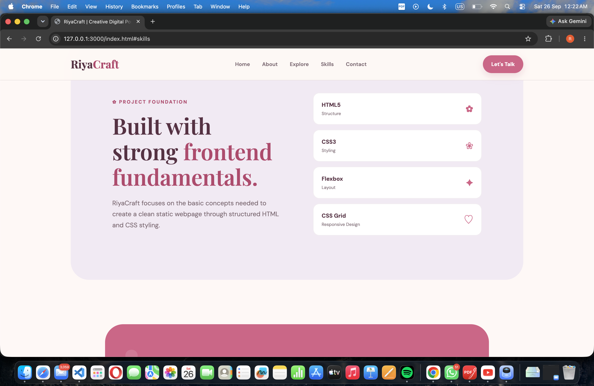
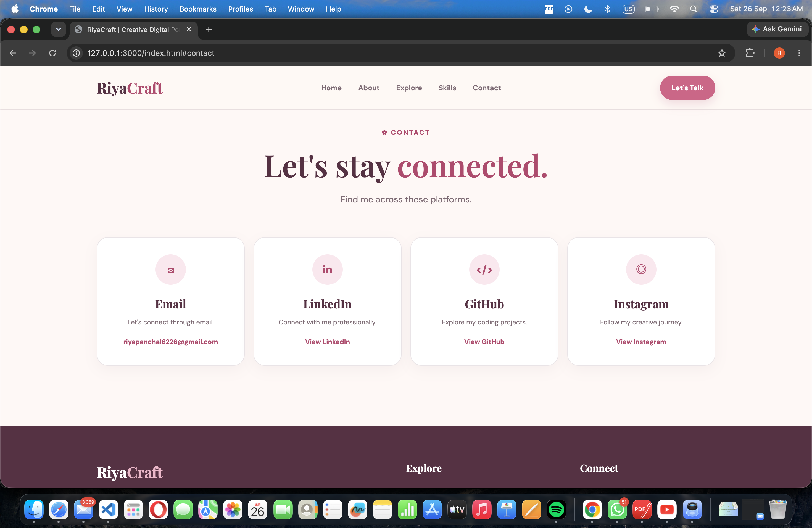

# 🌸 RiyaCraft – Digital Experience Website

> ✨ Crafting Ideas Into Beautiful Experiences.

RiyaCraft is a responsive static webpage created as part of the DecodeLabs Frontend Development Project 1.

## 🌐 Live Demo

👉 [View RiyaCraft Live](https://riyapanchaltech.github.io/RiyaCraft-Static-Website/)

## 🛠️ Technologies Used

- HTML5
- CSS3
- Google Fonts

## ✨ Features

- 🌸 Clean and aesthetic design
- 📱 Responsive layout
- 🧩 Semantic HTML structure
- 🎨 Modern CSS styling
- 💻 Flexbox and CSS Grid
- 🖼️ Image integration
- ✨ Hover effects
- 🔗 Social media links
- 📩 Contact section
- 📱 Mobile-friendly design

## 📸 Screenshots

### 🏠 Home

### ✨ About

### 🎨 Explore

### 💻 Skills

### 📩 Contact

## 👩‍💻 Author

Riya Panchal

- GitHub: [RiyaPanchalTech](https://github.com/RiyaPanchalTech)
- LinkedIn: [Riya Panchal](https://www.linkedin.com/in/riya-panchal-57514032a)
- Instagram: [@riyapanchal6368](https://www.instagram.com/riyapanchal6368)
